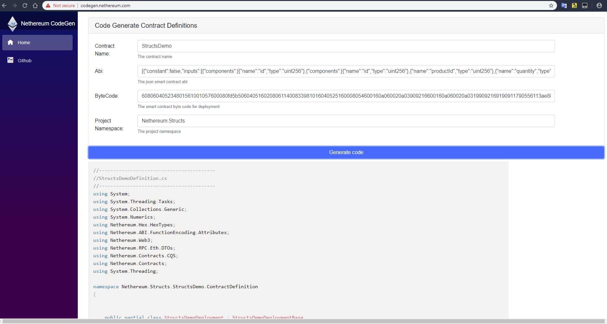

# Nethereum.CodeGen.Blazor

Code generator User Interface in Blazor.

This is the Nethereum code generator running in Blazor / Wasm. Just input your ABI, Bytecode, Contract name and Namespace to create your contract definitions for deployment, functions, events, struct (classes).

You can run it here: https://codegen.nethereum.com/

